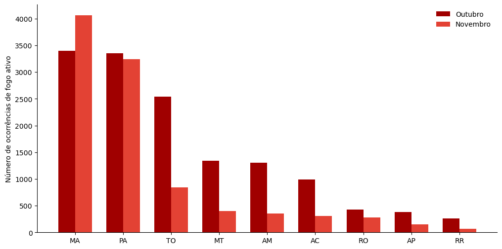

# Bem-vindos

Este é o portifólio das atividades desenvolvidas pela Coordenadação Operacional de Manaus (**COPER-MN**) do Centro Gestor e Operacional do Sistema de Proteção da Amazônia (**CENSIPAM**).

A COPER reúne os núcleo de:

🌦 **Meteorologia**

**🔥Painel do Fogo**

**🌊Hidrologia**

**🛰 Sensoriamento Remoto**

# Missão

Monitorar, analisar e gerar produtos técnicos estratégicos para apoio à tomada de decisão na Amazônia Legal.

<hr>



# Meteorologia

Disponibiliza informações meteorológica através do [*Painel da Meteorologia*](https://panorama.sipam.gov.br/painel/meteorologia) com informações detalhadas para a Amazônia Legal. Por meio da integração de modelos numéricos, dados de satélites e sensores meteorológicos, o portal fornece *previsões do tempo, tendências climáticas e alertas* para apoiar a tomada de decisão em diferentes setores.\
A plataforma é essencial para a gestão de riscos ambientais, permitindo o monitoramento de eventos meteorológicos extremos, como tempestades severas, ondas de calor e frentes frias.

## Atividades desenvolvidas

-   Monitoramento de precipitação

-   Análise de eventos extremos

-   Boletins técnicos\
    \
    \## Exemplo de Produto

```{r}
#| echo: false
#| warning: false
#| message: false
#| context: setup
#| include: true

library(ggplot2)

dados <- data.frame(
  mes = 1:12,
  chuva = c(250,300,280,260,220,150,90,70,120,180,240,270)
)

ggplot(dados, aes(x=mes, y=chuva)) +
  geom_line(color="#003366") +
  geom_point() +
  labs(title="Precipitação Mensal - Exemplo",
       x="Mês", y="Chuva (mm)")


```

## Link de acesso

[Painel da Meteorologia](https://panorama.sipam.gov.br/painel/meteorologia "Painel da Meteorologia")

<hr>



# Painel do Fogo

A [plataforma do Painel do Fogo](https://panorama.sipam.gov.br/painel-do-fogo/index.html) disponibiliza informações em tempo quase real sobre o monitoramento do uso do fogo (queimadas e incêndios) em todo o território brasileiro e nos países da Organização do Tratado de Cooperação Amazônica (OTCA: Bolívia, Brasil, Colômbia, Equador, Guiana, Peru, Suriname e Venezuela).\
Combinando dados de diferentes satélites, o Painel do Fogo informa o 'perímetro' e o 'status' mais recente de ocorrência de fogo através da análise de focos de calor e de eventos de fogo, permitindo a associação das ocorrências e subsidiar o acionamento de brigadas ou batalhões.\
A plataforma também prioriza eventos por indicadores comparativos e oferece consciência situacional com dados ambientais e imagens ópticas, auxiliando na definição de estratégias de combate ao fogo com filtros por estado e município.

## Atividades desenvolvidas

-   Monitoramento de Eventos de Fogo

-   Análise de eventos extremos

-   Boletins técnicos

    \
    \## Exemplo de Produto

    

    ```{r}
    #| echo: false
    #| warning: false
    #| message: false
    #| context: setup
    #| include: false

    fogo <- data.frame(
      mes = 1:12,
      focos = c(50,40,30,60,120,300,500,800,600,200,100,70)
    )

    ggplot(fogo, aes(mes, focos)) +
      geom_line(color="red") +
      geom_point(color="darkred") +
      labs(title="Focos de Fogo - Exemplo",
           x="Mês", y="Quantidade")

    ```

## Link de acesso

<https://panorama.sipam.gov.br/painel-do-fogo/index.html>

<hr>



# Hidrologia

Disponibiliza informações de monitoramento e previsão de condições hidrometeorológicas na Amazônia Legal em tempo quase real pela [plataforma web](https://hidro.sipam.gov.br/). Através da integração de dados, hardware e softwares, a plataforma fornece informações valiosas para prevenir impactos de eventos naturais extremos em áreas urbanas, apoiando a tomada de decisão e o planejamento preventivo através do [sistema SipamHidro](https://hidro.sipam.gov.br/map).

## Atividades desenvolvidas

-   Monitoramento e alertas de:

    -   Níveis dos rios;

    -   Reservatórios U.H.E;

    -   Descargas elétricas;

    -   Cheia e vazante.

-   Integração com dados meteorológicos

-   [Boletim Hidrometeorológico](https://hidro.sipam.gov.br/boletins)

    \## Exemplo de Produto

    ```{r}
    #| echo: false
    #| warning: false
    #| message: false
    #| context: setup
    #| include: true

    nivel <- data.frame(
      dia = 1:30,
      nivel = runif(30, 15, 25)
    )

    plot(nivel$dia, nivel$nivel,
         type="l",
         col="#0072B2",
         main="Nível do Rio - Exemplo",
         xlab="Dia",
         ylab="Nível (m)")

    ```

# Sensoriamento Remoto

Monitoramento de áreas antropizadas com presença de atividades ilícitas por meio do sensoriamento remoto para subsidiar ações de geointeligência, como a metodologia de Localização de Garimpos (LOGAR) e de Pistas de Pouso (LOPIS). Esses ativos de Inteligência Tecnológica são utilizados para detectar, identificar, analisar e monitorar as atividades de extração mineral ilegal e de campos de pouso irregulares. Além de outros ilícitos (narcotráfico, tráfego aereo desconhecido, pirataria fluvial e pesca ilegal para órgãos de fiscalização, segurança pública e forças armadas possibilitando um direcionamento para o combate às atividades ilícitas na Amazônia Legal.

## Atividades desenvolvidas

-   Processamento de imagens;

-   Quantificação da área mapeada e analisada;

-   Identificação de ilícitos ambientais;

-   Geração de mapas temáticos

    ```{r}
    #| echo: true
    library(leaflet)

    leaflet() %>%
      addTiles() %>%
      setView(-60, -3, zoom=5)

    ```

## Link da plataforma

<hr>



# Capacitações integradas

Capacitação voltada para análise de dados integrados geoespacial e meteorológico para o monitoramento ambiental.

1.  Uso das Plataformas do Painel da meteorologia, Painel do Fogo e SipamHidro.
2.  Integração Fogo-Clima: Associação de ocorrência de fogo com base em dados meteoroogicos
3.  Modelagem Hidrológica (SipamHidro): Cruzamento de dados de precipitação e monitoramento de níveis de rios para a previsão de cheias;
4.  Sensoriamento Remoto: utlização de imagens e vetores para análises espaciais dos dados geoespacial integrados e meteorológico;
5.  Curso de QGis e outras ferramentas de análises geoespaciais.

<hr>



# Eventos

## [Reunião Climática 2026](https://www.gov.br/censipam/pt-br/central-de-conteudos/seminarios/reuniao-climatica-2026)

Data: 27 de fevereiro de 2026\
Local: Censipam de Porto Velho\
Formato: Presencial e [Virtual](https://www.youtube.com/live/TSCDcwHcaW4)

## [Pré-Cheia: Prognostico para 2026](https://www.gov.br/censipam/pt-br/central-de-conteudos/seminarios/pre-cheia-2026)

Data: 05 de março de 2026\
Local: Censipam de Porto Velho\
Formato: Presencial e Virtual

## 4º Seminário do Painel do Fogo e 2ºEncontro Operacional de 2026

Data: 06 a 10 de julho de 2026\
Local: Censipam - Manaus\
Formato: Presencial e Virtual

## Pré-Seca: Prognostico para 2026

Data:\
Local:

<hr>

# Contato

Email institucional\
Telefone institucional

Recomeçar

Adaptar o visual para ficar mais institucional (cores oficiais do CENSIPAM) e Ir para PASSO 3 — Publicar no GitHub Pages
